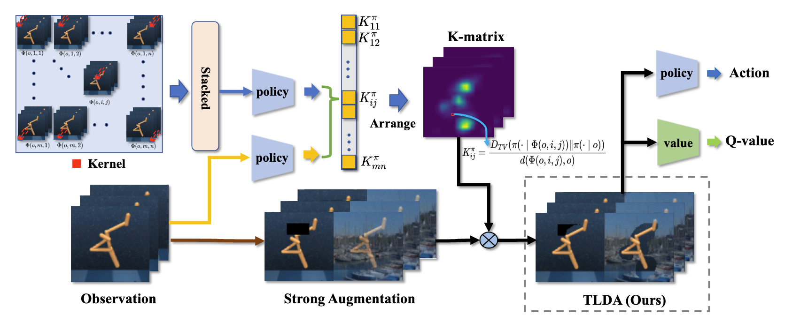

# TLDA
Codebase for “Don’t Touch What Matters: Task-Aware Lipschitz Data Augmentation for Visual Reinforcement Learning”


## Enviroment Setup
The following commands can install all depenedcies and libararies for this work:

   ``conda env create -f conda.yaml``

Your installed conda environment can be activated as follows:


``conda activate tlda``

## Usage
Running the code as the following steps:

1. install the experimental enviroment:
    
   ``setup/install_envs.sh``


2. The bash script is ready for running the code. Or you can run the following command in your terminal:

   ```
   python3 src/train.py \
     --algorithm tlda \
     --seed 1
   ```
   This should give you an output of the form like:

   ```
   Working directory: logs/cheetah_run/tlda/1
   Evaluating: logs/cheetah_run/tlda/1
   | eval | S: 0 | ER: 26.2285 | ERTEST: 25.3730
   | train | E: 1 | S: 250 | D: 50.8 s | R: 0.0000 | ALOSS: 0.0000 | CLOSS: 0.0000 | AUXLOSS: 0.0000
   | train | E: 2 | S: 500 | D: 0.2 s | R: 14.5838 | ALOSS: 0.0000 | CLOSS: 0.0000 | AUXLOSS: 0.0000
   ```
3. For the data augmentation, you can download the Place dataset as follows:

   ``wget http://data.csail.mit.edu/places/places365/places365standard_easyformat.tar``


## Acknowledgement
Our code implementation is based on [DMC-GB](https://github.com/nicklashansen/dmcontrol-generalization-benchmark). We would like to thank the researchers to open their source code and give detailed instructions.  

## Citation
If you use our repo in your own work, you can cite our paper as follows:
```
@article{yuan2022don,
  title={Don't Touch What Matters: Task-Aware Lipschitz Data Augmentation for Visual Reinforcement Learning},
  author={Yuan, Zhecheng and Ma, Guozheng and Mu, Yao and Xia, Bo and Yuan, Bo and Wang, Xueqian and Luo, Ping and Xu, Huazhe},
  journal={arXiv preprint arXiv:2202.09982},
  year={2022}
}
```
